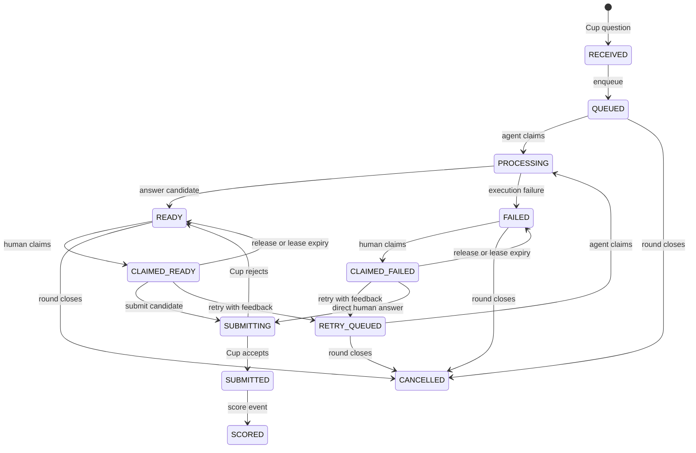
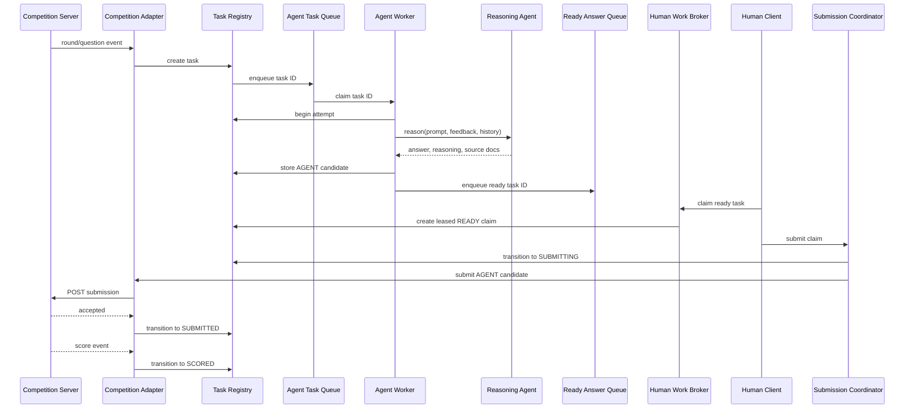
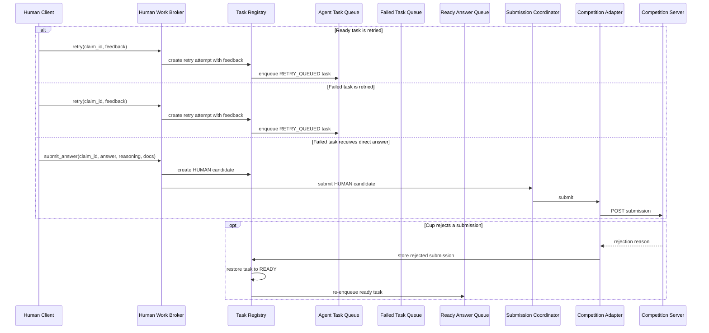

# Skunk Human GUI Architecture (Proposed)

## 1. System Overview

```text
                     +----------+----------------------+
                     | skunk_client/client.py          |
                     |                                 |
                     | Human UI: claim, release,       |
                     | submit, retry, direct answer,   |
                     | and inspect server feedback.    |
                     +---------------------------------+
                                   ^                                                  
                                   |                                                                     
+-----------------------------+    |      +-----------------------------+                                                                                                                    
| External Competition Server |    |      | skunk_reasoner.py           |                                                                                                                  
|                             |    |      |                             |                                                                                                                  
| practice_server.py (local)  |    |      | Creates and invokes the     |                                                                                                                 
| or competition Cup server   |    |      | Orchestrator. Returns an    |                                                                                                              
+--------------+--------------+    |      | answer or raises a failure. |                                                                                  
               ^                   |      +-----------------------------+                                               
               | Cup HTTP events   |               ^                         
               |                   |               | reason(prompt,                                              
               |                   |               | feedback,          
               |                   |               | attempt history)      
               v                   v               v                                               
+-----------------------------------------------------------------------+
| Skunk Server process                                                  |
|                                                                       |
|  +----------------------------+                                       |
|  | skunk_server/server.py     |                                       |
|  |                            |                                       |
|  | Composition root: creates  |                                       |
|  | modules and manages their  |                                       |
|  | startup and shutdown.      |                                       |
|  +-------------+--------------+                                       |
|                |                                                      |
|      +---------+----------+--------------------+                      |
|      |                    |                    |                      |
|      v                    v                    v                      |
|  +------------------+  +------------------+  +---------------------+  |
|  | competition_     |  | api.py           |  | events.py           |  |
|  | adapter.py       |  |                  |  |                     |  |
|  |                  |  | HTTP command API |  | WebSocket snapshots |  |
|  | Cup HTTP and WS  |  | for clients      |  | and state updates   |  |
|  +--------+---------+  +---------+--------+  +----------+----------+  |
|           |                      |                      ^             |
|           v                      v                      |             |
|  +----------------------------------------------------------------+   |
|  | task_registry.py                                               |   |
|  |                                                                |   |
|  | Authoritative tasks, attempts, candidates, claims, submissions |   |
|  | and atomic state transitions                                   |   |
|  +-------------------------------+--------------------------------+   |
|                                  ^                                    |
|                                  | task IDs and state transitions     |
|                                  v                                    |
|  +----------------------------------------------------------------+   |
|  | task_queues.py                                                 |   |
|  |                                                                |   |
|  | Agent Task Queue | Ready Answer Queue | Failed Task Queue      |   |
|  +-------------+----------------------+---------------------------+   |
|                |                      |                               |
|                v                      v                               |
|  +--------------------------+  +-------------------------------+      |
|  | agent_worker_pool.py     |  | human_work_broker.py          |      |
|  |                          |  |                               |      |
|  | Worker threads claim     |  | Exclusive renewable claims    |      |
|  | agent task IDs and run   |  | over ready and failed tasks   |      |
|  | the reasoner adapter     |  +---------------+---------------+      |
|  +------------+-------------+                  |                      |
|               |                                | human commands       |
|               | answer or failure              v                      |
|               |                   +-------------------------------+   |
|               +------------------>| submission_coordinator.py     |   |
|                                   |                               |   |
|                                   | Validates explicit human      |   |
|                                   | submissions and calls the     |   |
|                                   | Competition Adapter           |   |
|                                   +-------------------------------+   |
+-----------------------------------------------------------------------+
```

The real Competition Server is external to Skunk. During local development,
`practice_server.py` substitutes for it and exposes the same Cup HTTP and
WebSocket surfaces. The existing `cup_kit.client` and `cup_kit.protocol`
modules remain the boundary between the Competition Server and Skunk Server.
Each labeled box in the overview corresponds to one proposed Python file.
`task_queues.py` owns the three related queue instances, while `server.py`
contains composition and lifecycle wiring rather than domain logic.

## 2. Component Responsibilities

### Skunk Server

- Owns the authoritative task state and all queue transitions.
- Receives questions and round events through the Competition Adapter.
- Runs the Agent Worker Pool and injects the configured reasoner into workers.
- Brokers exclusive human claims over ready and failed tasks.
- Validates and forwards explicit human-approved submissions.
- Publishes state changes to connected clients.

The server does not render reasoning itself, fabricate missing reasoning, or
allow clients to contact the Competition Server or orchestrators directly.

### Competition Adapter

- Wraps `cup_kit.client.CupClient`.
- Converts Cup round and question events into internal tasks.
- Sends submissions prepared by the Submission Coordinator.
- Converts accepted, rejected, and scored responses into registry transitions.

It contains no queue scheduling or human-workflow policy.

### Agent Workers

- Are server-owned worker threads.
- Atomically claim IDs from the Agent Task Queue.
- Invoke a Reasoning Agent or Orchestrator with the prompt, retry feedback, and
  previous attempt history.
- Store an `AnswerCandidate` on success.
- Normalize exceptions into a `FailureRecord`.
- Post completions back to the server event loop.

Agent workers never submit answers to the Competition Server.

### Skunk Clients / Human Workers

Each connected client creates a `HumanWorkerSession`. A client may atomically
claim one available item through the Human Work Broker:

- A ready answer may be submitted or retried with free-text feedback.
- A failed task may be retried with free-text feedback or answered directly by
  the human and submitted.

Clients are thin interfaces. They do not own durable task state, Cup
credentials, or reasoning runtimes.

## 3. Authoritative Records

```text
QuestionTask
- task_id: "<round_num>:<question_id>"
- round_num: int
- question_id: str
- prompt: str
- status: TaskStatus
- current_attempt_id: uuid | None
- attempts: list[Attempt]
- answer_candidates: list[AnswerCandidate]
- failures: list[FailureRecord]
- submissions: list[SubmissionRecord]
- round_ends_at: datetime | None
- version: int
- created_at: datetime
- updated_at: datetime

Attempt
- attempt_id: uuid
- task_id: str
- attempt_number: int
- worker_id: str
- feedback: str | None
- previous_attempt_ids: list[uuid]
- started_at: datetime
- completed_at: datetime | None

AnswerCandidate
- candidate_id: uuid
- attempt_id: uuid
- answer_text: str
- reasoning: str
- source_docs: list[str]
- submission_type: AGENT | HUMAN
- created_at: datetime

FailureRecord
- failure_id: uuid
- attempt_id: uuid
- error_type: str
- error_message: str
- traceback: str | None
- created_at: datetime

HumanClaim
- claim_id: uuid
- task_id: str
- client_session_id: str
- source_kind: READY | FAILED
- lease_expires_at: datetime
- status: ACTIVE | RELEASED | EXPIRED

SubmissionRecord
- local_submission_id: uuid
- task_id: str
- candidate_id: uuid
- submission_type: AGENT | HUMAN
- status: PENDING | ACCEPTED | REJECTED | SCORED
- cup_submission_id: str | None
- rejection_reason: str | None
- correct: bool | None
- points_awarded: float | None
- submitted_at: datetime
```

The Task Registry is authoritative. Queues contain task and attempt IDs, not
independent copies of task state.

## 4. Task Lifecycle



A Cup business rejection creates a rejected `SubmissionRecord`, preserves the
rejection feedback, restores the task to `READY`, and re-enqueues it on the
Ready Answer Queue while the round remains active.

## 5. Normal Submission Flow



## 6. Retry and Failure Flows



## 7. Queue and Concurrency Semantics

- Registry transitions are atomic and version checked.
- The three bounded queues provide backpressure and carry IDs only.
- One task may have at most one active agent attempt, one active human claim,
  and one pending submission.
- Each processing attempt receives a unique ID. A completion whose attempt ID
  is no longer current is discarded as stale.
- At-least-once execution means a task may be redelivered after recovery or a
  failed handoff. It does not permit simultaneous duplicate active attempts.
- Human claims atomically reserve work and include a renewable lease.
- Release, disconnect, or lease expiry returns actionable work to the queue
  recorded by `HumanClaim.source_kind`.
- Worker threads use a thread-safe registry/queue boundary. They post
  completions to the async server event loop, which broadcasts updates.
- Mutating HTTP commands carry idempotency keys.

## 8. Reasoner Contract

The initial reasoner boundary is conceptually:

```python
reason(
    prompt: str,
    feedback: str | None,
    attempt_history: list[Attempt],
) -> AnswerCandidate
```

Retry feedback and previous attempts are supplied as context. The adapter
normalizes the existing `skunk_reasoner.py` and `Orchestrator` output into
`answer_text`, `reasoning`, and `source_docs`. Exceptions become structured
failures rather than escaping the worker loop.

## 9. Client Protocol

HTTP is authoritative for commands:

```text
GET  /api/state
GET  /api/tasks
GET  /api/tasks/{task_id}
POST /api/claims
POST /api/claims/{claim_id}/renew
POST /api/claims/{claim_id}/release
POST /api/submissions
POST /api/retries
POST /api/human-answers
```

The WebSocket is server-push only in the initial implementation:

```text
state_snapshot
task_created
task_updated
claim_expired
round_updated
submission_updated
score_updated
```

## 10. Submission Rules

Every Cup `SubmitRequest` contains:

```text
answer_text: non-empty string
reasoning: string
source_docs: list[str]
submission_type: AGENT | HUMAN
```

Generated candidates use `submission_type=AGENT`. Direct human final answers
use `submission_type=HUMAN`. Human reasoning may be empty only if the Cup
protocol permits it. The server validates the protocol limits and never pads
or fabricates reasoning or sources.

## 11. Correctness and Security Invariants

- Cup credentials exist only in the Skunk Server.
- Clients cannot submit without an active claim.
- Claims, attempts, and submissions are checked against the current task
  version.
- Submission is blocked after round closure or deadline expiry.
- The Competition Adapter is the only component that calls Cup APIs.
- The Submission Coordinator acts only after an explicit human command by
  default.
- Ready and failed work cannot be claimed by two clients simultaneously.
- Internal errors and tracebacks are sanitized before being sent to clients.

## 12. Provisional Module Layout

```text
harness_ui/
  cup_kit/                         # existing Cup boundary
    client.py
    protocol.py
    practice_server.py

  skunk_server/                    # proposed
    app.py
    config.py
    domain.py
    task_registry.py
    queues.py
    competition_adapter.py
    agent_worker_pool.py
    human_work_broker.py
    submission_coordinator.py
    events.py
    routes.py

  skunk_client/                    # proposed
    client.py
    ui/

  practice_server.py               # existing local Cup launcher
  skunk_reasoner.py                # existing reasoner adapter
  competition_console.py           # current monolithic implementation
```

Names are provisional. `competition_console.py` remains the current
implementation until the replacement reaches behavioral parity.

## 13. Migration Plan

1. Extract domain records, the Task Registry, and atomic transitions from
   `competition_console.py` without changing observable behavior.
2. Introduce bounded queues, the Agent Worker Pool, Competition Adapter, and
   Submission Coordinator behind the existing UI.
3. Add the Human Work Broker, leased claims, HTTP commands, WebSocket events,
   and the separate Skunk Client.
4. Add persistence and restart recovery, verify parity against
   `practice_server.py`, then deprecate the monolithic console.

## 14. Initial Decisions

- Start with an in-memory registry and define a persistence boundary.
- Use worker threads initially.
- Require explicit human submission; auto-submit is off.
- Use HTTP for commands and WebSocket for server-pushed events.
- Use renewable, exclusive human claims.
- Preserve complete attempt, feedback, failure, and submission history.

## 15. Open Questions

- Should persistence use SQLite from the first implementation or be added
  after the in-memory workflow is stable?
- How should human clients authenticate?
- Should work assignment remain first-claim-wins or support server-assigned
  round-robin or priority scheduling?
- Should an optional auto-submit mode ever be supported?
- Should Cup rejection and scoring feedback be appended automatically to retry
  context, or only when selected by a human?
- Do worker threads provide enough model/runtime isolation, or should reasoning
  agents eventually run in separate processes?
