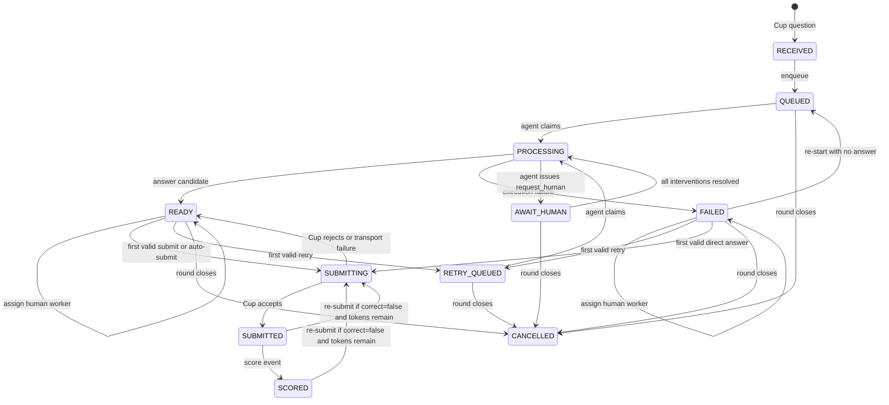
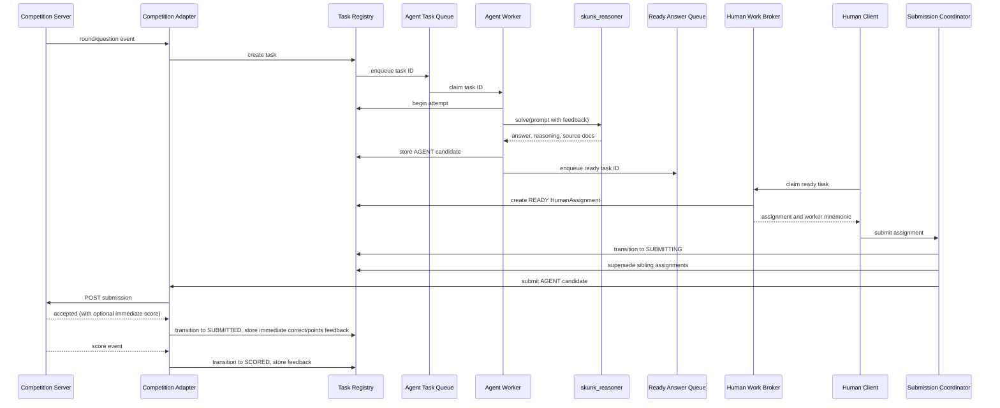
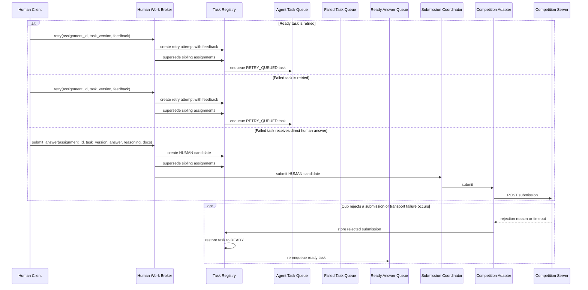

# Skunk Human GUI Architecture (Implemented)

## 1. System Overview

```text
+-----------------------------+  +-----------------------------+  +-----------------------------+
| External Competition Server |  | skunk_client/client.py      |  | skunk_reasoner.py           |
|                             |  |                             |  |                             |
| practice_server.py (local)  |  | Human UI and operator       |  | Creates and invokes the     |
| or competition Cup server   |  | commands                    |  | Orchestrator                |
+--------------+--------------+  +--------------+--------------+  +--------------+--------------+
               ^                                ^                                ^
               | Cup HTTP and WS                | HTTP and WebSocket             | reasoning calls
               v                                v                                v
+------------------------------------------------------------------------------------------------+
| Skunk Server process                                                                            |
|                                                                                                 |
|  +-----------------------------+  +-----------------------------+  +--------------------------+ |
|  | competition_adapter.py      |  | api.py and events.py        |  | agent_worker_pool.py     | |
|  |                             |  |                             |  |                          | |
|  | Receives Cup events and     |  | HTTP commands from clients  |  | Worker threads invoke    | |
|  | sends Cup submissions       |  | and WebSocket updates       |  | the reasoner adapter     | |
|  +--------------+--------------+  +--------------+--------------+  +-------------+------------+ |
|                 |                                |                               |              |
|                 +----------------+---------------+-------------------------------+              |
|                                  | internal commands and results                                |
|                                  v                                                              |
|  +------------------------------------------------------------------------------------------+   |
|  | task_registry.py                                                                         |   |
|  |                                                                                          |   |
|  | Authoritative tasks, attempts, candidates, assignments, submissions, and transitions     |   |
|  +-------------------------------------------+----------------------------------------------+   |
|                                              ^                                                  |
|                                              | task IDs and state transitions                   |
|                                              v                                                  |
|  +------------------------------------------------------------------------------------------+   |
|  | task_queues.py                                                                           |   |
|  |                                                                                          |   |
|  |      Agent Task Queue             Ready Answer Queue            Failed Task Queue        |   |
|  +---------------+----------------------------+----------------------------+----------------+   |
|                  |                            |                            |                    |
|                  |                            +-------------+--------------+                    |
|                  |                                          v                                   |
|                  |                           +-----------------------------+                    |
|                  |                           | human_work_broker.py        |                    |
|                  |                           |                             |                    |
|                  |                           | Assigns ready/failed work   |                    |
|                  |                           | to one or more workers      |                    |
|                  |                           | Handles human interventions |                    |
|                  |                           | and request_human handling  |                    |
|                  +--------------+------------+--------------+---------------+                    |
|                  |                            |                            |                    |
|                  |                            v                            v                    |
|                  |           +---------------------------+ +-----------------------------+      |
|                  |           | submission_coordinator.py | | human_worker_registry.py    |      |
|                  |           |                           | |                             |      |
|                  |           | Validates manual or auto  | | Worker UUIDs, sessions,     |      |
|                  |           | submissions, delegates to | | display names, presence     |      |
|                  |           | competition_adapter       | |                             |      |
|                  |           +---------------------------+ +-----------------------------+      |
|                  |                                                                             |
|  +------------------------------------------------------------------------------------------+   |
|  | server.py                                                                                |   |
|  | Composition root: creates modules, manages process startup/shutdown, dependency wiring   |   |
|  +------------------------------------------------------------------------------------------+   |
+------------------------------------------------------------------------------------------------+
```

The real competition Server is external to Skunk. During local development,
`practice_server.py` substitutes for it and exposes the same Cup HTTP and
WebSocket surfaces. The existing `cup_kit.client` and `cup_kit.protocol`
modules remain the boundary between the Competition Server and Skunk Server.
Each labeled box corresponds to one actual Python file.

The legacy `harness_ui/competition_console.py` is retained in the repository
but is no longer the active entry point. The three-process architecture is now
launched by two scripts: `run_practice_server.sh` (the Cup question/scoring
server — the role Databricks plays in the real Cup) and `run_solution.sh` (our
agent backend + web UI).

## 2. Component Responsibilities

### Skunk Server

- Owns the authoritative task state and all queue transitions.
- Receives questions and round events through the Competition Adapter.
- Runs the Agent Worker Pool and injects the configured reasoner into workers.
- Registers human workers and stores their stable IDs and saved display names.
- Assigns ready and failed tasks to one or more human workers.
- Validates and forwards manual or configured automatic submissions.
- Publishes state changes to connected clients.
- Manages human intervention lifecycle (requests, claims, resolution).

The server does not render reasoning itself, fabricate missing reasoning, or
allow clients to contact the Competition Server or orchestrators directly.

### Competition Adapter

- Wraps `cup_kit.client.CupClient`.
- Converts Cup round and question events into internal tasks.
- Sends submissions prepared by the Submission Coordinator.
- Converts accepted, rejected, and scored responses into registry transitions.

It contains no queue scheduling or human-workflow policy.

### Agent Workers

- Are server-owned worker threads.
- Atomically claim IDs from the Agent Task Queue.
- Invoke `skunk_reasoner.solve(prompt)` where prompt includes retry feedback
  and available Cup rejection or scoring feedback appended by the server for
  backward compatibility.
- When the orchestrator or reasoner encounters a recoverable `MissingData`, it
  **must** call the configured `human_intervention_handler` (if one is provided)
  with `kind="missing_data"` and await a response before replanning. If no
  handler is configured, the `MissingData` is re-raised and no replan occurs.
- Additionally, during the first internal recovery round after `MissingData`,
  newly run search-agent retrieval and external lookup branches may expose
  `request_human` for optional additional granular requests (e.g.,
  `pdf_extraction`, `external_lookup`).
- Store an `AnswerCandidate` on success.
- Normalize exceptions into a `FailureRecord`.
- Post completions back to the server event loop via a thread-safe async queue.

Agent workers never submit answers to the Competition Server.

### Skunk Clients / Human Workers

Each new client WebSocket connection creates a new human worker with an
immutable `worker_id` UUID. No authentication or identity recovery is
required. A user may save a natural-language `display_name` through the UI by
sending `PUT /api/workers/{worker_id}` with JSON body
`{"display_name": "Treasury Tables"}`. Display names need not be unique, so
assignments are shown as `<display_name> (<short worker_id>)`, for example
`Treasury Tables (a13f)`.

The client shows an overview of all tasks in the current competition round and
their statuses. Once agent execution reaches `READY` or `FAILED`, a Claim
button lets a human create an assignment for that task. The same task may be
claimed by multiple workers:

- A ready answer may be submitted or retried with free-text feedback.
- A failed task may be retried with free-text feedback or answered directly by
  the human and submitted.

The first valid action atomically transitions the task. Other active
assignments for the old task version become `SUPERSEDED`.

The task detail overlay is intentionally inset lower in the viewport, with a
14vh top offset, so the header round timer remains visible above the popup.
The review overlay source-page viewer supports DAIS-style document/page
references such as `cleaned_pages/<document_id>_<page>.txt` and does not
require Treasury Bulletin month labels.
For a `FAILED` task with no answer candidate and no submission, the detail
overlay shows a `re-start` button. The operator may provide optional feedback;
the server records that feedback as context for the next fresh agent attempt,
returns the task to `QUEUED`, and enqueues it on the Agent Task Queue.

For a submitted or scored answer whose latest Cup result is `correct=false`,
the detail overlay shows `Re-submit Answer` while Cup resubmit tokens remain.
The command reuses the existing manual submit endpoint and the `Resubmits`
header counter is updated from Cup `tokens_remaining`.
The `Re-submit Answer` control requires explicit user confirmation before the
resubmission is sent.

Additionally, the client displays an "Await Human" summary count and status area
for each task that is in `AWAIT_HUMAN` processing. Request cards show the
kind, instructions, context, and source document links. Each request card
has a Claim button (if status is `PENDING`) and, if claimed by the current
worker, a Release button and response controls (text area for response,
textarea for one source reference per line, and a Resolve button).

Clients are thin interfaces. They do not own durable task state, Cup
credentials, or reasoning runtimes.

The client process runs as a separate FastAPI application. Its browser-based
UI communicates directly with the Skunk Server via HTTP and WebSocket under
permissive CORS configuration.

### Human Worker Registry

- Allocates a new immutable `worker_id` UUID for every new client connection.
- Stores the optional user-supplied `display_name` when Save is pressed.
- Tracks the connection session and presence for that ephemeral worker.
- Produces mnemonic UI labels such as `Treasury Tables (a13f)`.
- Resolves the full worker UUID for assignment ownership checks.

It does not assign tasks, decide which human action wins, or track intervention claims;
those remain the responsibility of the Human Work Broker and atomic Task Registry transitions.

### Human Work Broker (extended)

- Handles assignment creation when human claims a task.
- Processes retry requests with feedback.
- Processes direct human answer submissions.
- Validates assignment ownership and task version.
- Coordinates with TaskRegistry for atomic transitions.
- Manages `request_human` intervention lifecycle:
  - Receives intervention requests from agent workers (via the task's bound handler).
  - Creates a `HumanIntervention` record in the task.
  - Transitions the task to `AWAIT_HUMAN`.
  - On claim, transitions intervention to `CLAIMED` (exclusive - cannot be claimed by another worker while active).
  - On release, returns intervention to `PENDING`.
  - On resolve, sets the response fields and transitions intervention to `RESOLVED`.
  - When all interventions for the active attempt are resolved (none remain `PENDING` or `CLAIMED`), transitions the task back to `PROCESSING` and resumes the waiting agent worker.
  - Cleans up and cancels all pending waiters on round close or server shutdown.
- For mandatory `missing_data` requests, the broker stores the provided `guidance` dict on the `HumanIntervention` record and emits `replan_pending` and `replan` orchestration events at the appropriate lifecycle points.

### submission_coordinator.py

- Validates submission requests (deadline checks, protocol limits).
- Handles both manual submission and auto-submit configuration.
- Dispatches to CompetitionAdapter for Cup communication.
- Stores submission records on success or failure.

### server.py

- Composition root: creates all modules with dependency injection.
- Manages process startup: initializes queues, pools, adapters.
- Manages shutdown: graceful worker thread termination, cleanup.
- Configures and starts the FastAPI application.

## 3. Authoritative Records

```text
QuestionTask
- task_id: str (format: "<round_num>:<question_id>")
- round_num: int
- question_id: str
- prompt: str
- status: TaskStatus enum
- current_attempt_id: uuid | None
- attempts: list[Attempt]
- answer_candidates: list[AnswerCandidate]
- failures: list[FailureRecord]
- submissions: list[SubmissionRecord]
- round_ends_at: datetime | None
- version: int
- created_at: datetime
- updated_at: datetime
- human_interventions: list[HumanIntervention]

Attempt
- attempt_id: uuid
- task_id: str
- attempt_number: int
- worker_id: str
- feedback: str | None
- previous_attempt_ids: list[uuid]
- started_at: datetime
- completed_at: datetime | None

AnswerCandidate
- candidate_id: uuid
- attempt_id: uuid
- answer_text: str
- reasoning: str
- source_docs: list[str]
- submission_type: SubmissionType (AGENT | HUMAN)
- created_at: datetime

FailureRecord
- failure_id: uuid
- attempt_id: uuid
- error_type: str
- error_message: str
- traceback: str | None
- created_at: datetime

HumanWorker
- worker_id: uuid
- display_name: str | None
- created_at: datetime
- updated_at: datetime

HumanWorkerSession
- session_id: uuid
- worker_id: uuid
- connected_at: datetime
- last_seen_at: datetime
- status: SessionStatus (CONNECTED | DISCONNECTED)

HumanAssignment
- assignment_id: uuid
- task_id: str
- worker_id: uuid
- task_version: int
- source_kind: AssignmentSource (READY | FAILED)
- assigned_at: datetime
- completed_at: datetime | None
- status: AssignmentStatus (ACTIVE | RELEASED | COMPLETED | SUPERSEDED)

HumanIntervention
- intervention_id: uuid
- task_id: str
- attempt_id: uuid
- kind: str                          # e.g. "missing_data", "pdf_extraction", "external_lookup"
- instructions: str
- context: str | None
- source_docs: list[str]
- status: HumanInterventionStatus (PENDING | CLAIMED | RESOLVED | CANCELLED)
- claimed_by: uuid | None
- guidance: dict | None              # populated for mandatory missing_data requests
- response: str | None
- response_source_docs: list[str]
- created_at: datetime
- claimed_at: datetime | None
- resolved_at: datetime | None

SubmissionRecord
- local_submission_id: uuid
- task_id: str
- candidate_id: uuid
- submission_type: SubmissionType
- status: SubmissionStatus (PENDING | ACCEPTED | REJECTED | SCORED)
- cup_submission_id: str | None
- rejection_reason: str | None
- correct: bool | None
- points_awarded: float | None
- submitted_at: datetime
```

The Task Registry is authoritative. Queues contain task IDs only, not
independent copies of task state.

## 4. Task Lifecycle



A Cup business rejection or a transport/network failure during submission
creates a rejected `SubmissionRecord`, preserves the rejection feedback,
restores the task to `READY`, and re-enqueues it on the Ready Answer Queue
while the round remains active.

When auto-submit is enabled, a generated candidate may move directly from
`READY` to `SUBMITTING` without a human assignment. Auto-submit uses the same
validation, idempotency, deadline checks, and Submission Coordinator as manual
submission.

Cup rejection, scoring, and accepted-with-immediate-score feedback are stored
on the task and automatically appended to the context of any later reasoning
attempt. WebSocket score events also update the records.

The `re-start` command is narrower than a scored-answer retry: it is available
only after an agent failure that produced no answer candidate and no submission.
It starts a new agent attempt from the original prompt plus optional operator
feedback. Resubmission is available only when the latest Cup-scored submission
has `correct=false`; token availability is taken from the round's Cup
`resubmits_left`/`tokens_remaining` values.

Human assignments do not change the task from `READY` or `FAILED`. An action
must include its `assignment_id` and observed `task_version`. The first valid
action advances the task and marks other active assignments for that version
as `SUPERSEDED`.

A human intervention (request) transitions `PROCESSING` to `AWAIT_HUMAN`. The
task stays in `AWAIT_HUMAN` as long as at least one `PENDING` or `CLAIMED`
intervention exists for the active attempt. When all such interventions are
`RESOLVED` (not `CANCELLED`), the task returns to `PROCESSING` and the waiting
agent worker resumes. If the round closes while in `AWAIT_HUMAN`, the task
transitions to `CANCELLED` and all interventions are marked `CANCELLED`.

## 5. Normal Submission Flow



## 6. Retry and Failure Flows



## 7. Queue and Concurrency Semantics

- Registry transitions are atomic and version checked.
- The three bounded `queue.Queue` instances provide backpressure and carry
  task IDs only.
- One task may have at most one active agent attempt and one pending
  submission, but may have multiple active human assignments.
- Each processing attempt receives a unique ID. A completion whose attempt ID
  is no longer current is discarded as stale.
- At-least-once execution means a task may be redelivered after recovery or a
  failed handoff. It does not permit simultaneous duplicate active attempts.
- Human assignment does not remove a task from the ready or failed workflow.
  Multiple workers may inspect the same task version concurrently.
- Assignments are created only when a human presses Claim for a `READY` or
  `FAILED` task shown in the current-round overview.
- Human actions include `assignment_id` and `task_version`. The first valid
  action wins atomically; stale actions are rejected and sibling assignments
  are marked `SUPERSEDED`.
- Worker threads use a thread-safe registry boundary. They post completions to
  the async server event loop via an internal async queue, and the event loop
  processes them and broadcasts updates.
- Mutating HTTP commands carry idempotency keys.
- Human interventions have exclusive claim: a `PENDING` intervention may be
  claimed by exactly one worker; while `CLAIMED`, no other worker may claim it.
  Only the claiming worker may release or resolve it. Round close and server
  shutdown cancel all pending and claimed interventions, waking any waiting
  agent workers with a cancellation signal.

## 8. Reasoner Contract

The reasoner boundary is backward-compatible:

```python
# skunk_reasoner.solve() is invoked by agent worker threads
def solve(prompt: str) -> tuple[str, str, list[str]]:
    """
    Returns (answer_text, reasoning, source_docs).

    prompt includes the original question plus any retry feedback and
    Cup rejection/scoring feedback appended by the server.
    """
```

Retry feedback, previous attempts, and available Cup rejection or scoring
feedback are supplied as context. Cup feedback is appended automatically; the
human does not need to repeat it in free text. The worker normalizes the
existing `skunk_reasoner.py` output into `answer_text`, `reasoning`, and
`source_docs`. Exceptions become structured failures rather than escaping the
worker loop. Workers can invoke either a synchronous or async `solve()`
depending on the underlying orchestrator; the interface is compatible with
both.

### Human Intervention Extension

For orchestrators or reasoners that support human-in-the-loop requests, the
Agent Worker pool injects an async `human_intervention_handler` function into
the reasoner's execution context. This handler is provided only if the
reasoner accepts a keyword argument named `human_intervention_handler`;
prompt-only reasoners are unaffected.

```python
async def human_intervention_handler(
    kind: str,
    instructions: str,
    context: str | None,
    source_docs: list[str],
    guidance: dict | None = None
) -> dict[str, Any]:
    """
    Called by the reasoner to request human assistance.

    - `kind`: a label like "missing_data", "pdf_extraction", or "external_lookup".
    - `instructions`: what the human should do.
    - `context`: additional background for the human (may be None).
    - `source_docs`: documents or references related to the request.
    - `guidance`: optional dict used for mandatory missing_data requests.
                  When present, contains keys: recovery_round, partial_plan,
                  gathered_values, failed_branches, likely_pages, missing, reason.

    Returns a dict with keys "response" (str) and "source_docs" (list[str])
    once a human resolves the intervention.
    """
```

**Mandatory MissingData handling:**
When the orchestrator or reasoner catches a recoverable `MissingData` (e.g., a
failed identifier lookup), it **must** call the configured
`human_intervention_handler` with `kind="missing_data"` and await the
response before replanning. This request includes the failure reason and
missing identifiers in `instructions`. It places the task in `AWAIT_HUMAN`
through the broker. The resolved response (the human's answer) is then added
to subsequent replanner and compute inputs as an `AnnotatedValue`. If no
`human_intervention_handler` is configured (i.e., the reasoner does not accept
the keyword argument or the pool does not inject it), the `MissingData`
exception is re-raised and no replan occurs.

Before awaiting the human, the orchestrator emits a plan event labeled
`replan_pending` carrying the `recovery_round` from the `guidance` dict.
After resolution and applying the diff, it emits a `replan` event carrying the
same `recovery_round`. The reasoning summarizer counts unique `recovery_round`
values across both `replan_pending` and `replan` events, so the Replans
counter increments while `AWAIT_HUMAN` and does not double-count after
resolution.

The mandatory request's `source_docs` are populated from likely retrieved
pages, prioritizing pages already attached to gathered values and then
deduplicating retrieved BlockRef member pages, capped at eight.

**Optional additional requests during first internal recovery round:**
Separately, during the first internal `MissingData` recovery round only,
newly run search-agent retrieval and external lookup branches also expose
`request_human` for optional additional granular requests. These can have
kinds like `"pdf_extraction"` or `"external_lookup"`. These are optional and
the reasoner may decide to call them or not. They are not mandatory for
recovery. The `RequestHumanTool` sends `None` for the `guidance` argument for
these optional model-created requests.

**Async execution model:**
When the reasoner's `solve()` is `async`, the agent worker thread schedules
the coroutine on the server's asyncio loop via
`asyncio.run_coroutine_threadsafe()` and waits for the result using
`future.result()`. This design keeps the human intervention APIs and the
suspended reasoner on the same asyncio loop, allowing the handler to
correctly await human resolution events that are processed on that loop.

If the reasoner's `human_intervention_handler` is called (whether for
mandatory `missing_data` or optional requests), it:

1. Creates a `HumanIntervention` record with status `PENDING`, storing the
   provided `guidance` dict (if any) in the record.
2. Transitions the task to `AWAIT_HUMAN` via the Task Registry.
3. Waits (asynchronously) until the intervention is resolved or cancelled.
4. On resolution, returns a dict with the human's response and any attached
   source documents.
5. On cancellation (e.g., round close or shutdown), raises a
   `RuntimeError('human intervention was cancelled')` that the reasoner should
   handle gracefully.

Only the first internal `MissingData` recovery round (per attempt) exposes
`request_human` for the optional additional branches; subsequent missing data
may be handled locally. The `MultiTurnAgent` orchestrator awaits the handler
and receives the response as a normal observation. The `AgentWorkerPool`
injects the handler; `RequestHumanTool` invokes it; the pool does not intercept
tool calls directly.

## 9. Client Protocol

HTTP is authoritative for commands:

```text
GET  /api/state              # full server state snapshot
GET  /api/tasks              # all tasks in current round
GET  /api/tasks/{task_id}    # single task detail
PUT  /api/workers/{worker_id} # save display name
POST /api/assignments        # claim a READY or FAILED task
POST /api/assignments/{assignment_id}/release  # release a claim
POST /api/submissions        # submit an AGENT candidate
POST /api/retries            # request retry with feedback
POST /api/human-answers      # submit a direct human answer
POST /api/interventions/{intervention_id}/claim   # claim a PENDING intervention
POST /api/interventions/{intervention_id}/release # release a CLAIMED intervention
POST /api/interventions/{intervention_id}/resolve # submit response and resolve
POST /api/restart/{task_id} # re-start FAILED task with no answer candidate
POST /api/submit/{task_id}  # submit READY or re-submit latest correct=false answer
```

The server creates a new worker UUID when the client WebSocket connection is
established and returns it in the initial state snapshot. The UI Save button
sends `PUT /api/workers/{worker_id}` with
`{"display_name": "Treasury Tables"}`. `POST /api/assignments` is called by
the task overview's Claim button and is valid only for `READY` or `FAILED`
tasks. Assignments and task views include both the UUID and the mnemonic label
`Treasury Tables (a13f)`.

Intervention endpoints behave as follows:

- `claim`: sets the intervention status to `CLAIMED` and records
  `claimed_by = requesting worker UUID`. Fails with HTTP 409 (TaskConflict) if already claimed.
- `release`: sets status back to `PENDING` and clears `claimed_by`. Fails
  with HTTP 409 if not the claiming worker.
- `resolve`: accepts a JSON body `{"response": string, "source_docs": list[str]}`,
  sets the intervention status to `RESOLVED`, stores the response data, and
  triggers the transition back to `PROCESSING` if no other interventions
  remain pending or claimed.

The WebSocket is server-push only:

```text
state_snapshot         # full state on connection (includes interventions)
task_created           # new task added
task_updated           # task status changed
worker_updated         # display name changed
assignment_created     # new assignment
assignment_updated     # assignment status changed
round_updated          # round info changed
submission_updated     # submission status changed
score_updated          # score event received
```

(The server broadcasts complete snapshots; no separate intervention events are sent.)

### Intervention Card Display (Client UI)

For mandatory `missing_data` interventions, the client intervention card
displays the following fields before claim/resolution:

- **Recovery round**: the `recovery_round` value from `guidance`.
- **Likely Source Pages**: clickable PDF links for each page in the `likely_pages` list from `guidance`.
- **Partial Plan**: the `partial_plan` dict from `guidance`, formatted as a nested list.
- **Gathered Values**: each entry in `gathered_values` is displayed with its description, value, unit, bulletin, and pages.
- **Failed Branches**: each entry in `failed_branches` is displayed with its branch identifier and error.

For optional requests (`kind` other than `"missing_data"), the `guidance`
field is `None` and these sections are omitted.

The task's Replans metric falls back to the pending intervention's
`recovery_round` when no completed candidate reasoning exists.

## 10. Endpoints and Module Responsibilities

### api.py (routes)

- Handles all HTTP endpoints listed above.
- Validates request bodies and dispatches to domain modules.
- Returns appropriate HTTP status codes and JSON responses.
- No domain logic beyond validation and dispatch.

### events.py

- Defines WebSocket event types and serialization.
- Manages connected client sessions for push notifications.
- Broadcasts state changes to all connected clients.

### competition_adapter.py

- Wraps `cup_kit.client.CupClient`.
- Receives Cup round/question events via subscription.
- Converts events to internal tasks via TaskRegistry.
- Sends `SubmitRequest` to Cup server on behalf of SubmissionCoordinator.
- Receives acceptance, rejection, and score responses.
- Stores feedback in TaskRegistry on Cup responses.

### domain.py

- Defines all data classes:
  `QuestionTask`, `Attempt`, `AnswerCandidate`, `FailureRecord`,
  `HumanWorker`, `HumanWorkerSession`, `HumanAssignment`, `SubmissionRecord`,
  `HumanIntervention`
- Defines enums:
  `TaskStatus`, `SubmissionType`, `SessionStatus`, `AssignmentStatus`,
  `SubmissionStatus`, `HumanInterventionStatus`
- Provides helper methods for status transitions.

### task_registry.py

- Authoritative in-memory store for all task state.
- Implements atomic state transitions with version checking.
- Creates and queries tasks, attempts, candidates, failures, submissions.
- Manages assignment lifecycle (create, supersede, complete).
- Manages intervention lifecycle (create, claim, release, resolve, cancel).
- Thread-safe access via locking.

### task_queues.py

- Creates three bounded `queue.Queue` instances:
  - Agent Task Queue (task IDs for agent processing)
  - Ready Answer Queue (task IDs with agent success)
  - Failed Task Queue (task IDs with agent failures)
- Provides thread-safe enqueue and dequeue operations.
- Provides requeue for retries.

### agent_worker_pool.py

- Launches and manages worker threads.
- Worker threads claim task IDs from Agent Task Queue.
- Each worker invokes `skunk_reasoner.solve(prompt)`.
- When the reasoner accepts the `human_intervention_handler` keyword argument,
  the worker injects a task-bound handler that communicates with the
  HumanWorkBroker. The pool does not intercept tool calls directly.
- On success, stores `AnswerCandidate` and enqueues to Ready Answer Queue.
- On failure, stores `FailureRecord` and enqueues to Failed Task Queue.
- Posts completions to async event loop via thread-safe async queue.
- For async `solve()` invocations, the worker schedules the coroutine on the
  server's asyncio loop using `asyncio.run_coroutine_threadsafe()` and blocks
  the thread on the resulting `Future`. This ensures the handler's wait for
  human resolution runs on the same loop that processes resolution events.

### human_worker_registry.py

- Manages in-memory store of `HumanWorker` and `HumanWorkerSession` records.
- Creates new worker UUID for each client WebSocket connection.
- Handles display name updates.
- Tracks connection status.
- Produces mnemonic labels.

It does not track intervention claims; the HumanWorkBroker handles claim ownership.

### human_work_broker.py

- Handles assignment creation when human claims a task.
- Processes retry requests with feedback.
- Processes direct human answer submissions.
- Validates assignment ownership and task version.
- Coordinates with TaskRegistry for atomic transitions.
- Manages `request_human` lifecycle:
  - Creates `HumanIntervention` records in the TaskRegistry, including storing
    the provided `guidance` dict (for mandatory `missing_data` requests).
  - Transitions task to `AWAIT_HUMAN`.
  - Handles claim, release, and resolve operations from API.
  - Monitors resolution status and transitions back to `PROCESSING` when all
    interventions for the active attempt are resolved (none remain `PENDING` or `CLAIMED`).
  - Cancels pending interventions on round close or shutdown (marks them `CANCELLED`).
- For mandatory `missing_data` requests, the broker coordinates with the
  orchestrator to emit `replan_pending` and `replan` plan events carrying the
  `recovery_round` from the `guidance`.

### submission_coordinator.py

- Validates submission requests (deadline checks, protocol limits).
- Handles both manual submission and auto-submit configuration.
- Dispatches to CompetitionAdapter for Cup communication.
- Stores submission records on success or failure.

### server.py

- Composition root: creates all modules with dependency injection.
- Manages process startup: initializes queues, pools, adapters.
- Manages shutdown: graceful worker thread termination, cleanup.
- Configures and starts the FastAPI application.

## 11. Submission Rules

Every Cup `SubmitRequest` contains:

```text
answer_text: non-empty string
reasoning: string
source_docs: list[str]
submission_type: "agent" | "human"
```

Generated candidates use `submission_type=agent`. Direct human final answers
use `submission_type=human`. Human reasoning may be empty only if the Cup
protocol permits it. The server validates the protocol limits and never pads
or fabricates reasoning or sources.

## 12. Correctness and Security Invariants

- Cup credentials exist only in the Skunk Server process.
- Human workers require no authentication. Every client WebSocket connection
  creates a distinct ephemeral worker UUID.
- Clients cannot act without an active assignment for the task version.
- Assignments, attempts, and submissions are checked against the current task
  version.
- Submission is blocked after round closure or deadline expiry.
- The Competition Adapter is the only component that calls Cup APIs.
- The Submission Coordinator accepts either an explicit human command or the
  configured auto-submit policy.
- Ready and failed work may be assigned to multiple clients simultaneously.
- Only the first valid action for a task version may transition the task.
- UI assignment labels include the saved display name and a short UUID suffix;
  assignment ownership checks always use the full immutable UUID.
- Intervention claims are exclusive: only one worker may hold a `CLAIMED`
  intervention at a time, and only that worker may release or resolve it.
  Conflict responses use HTTP 409 (TaskConflict).
- Internal errors and tracebacks are sanitized before being sent to clients.
- In-memory only: state is lost on server restart. No SQLite or other
  persistence is implemented.

## 13. Implementation Status and Verification

### Passed Tests (8 focused unit/integration tests in harness_ui/tests/test_skunk_server.py)

1. First human action supersedes sibling: concurrent claims on the same READY task; first submit moves task to SUBMITTING and marks other assignments SUPERSEDED.
2. Retry and Cup feedback attach to next attempt: retry creates a new attempt whose feedback field is set; on next agent solve the prompt includes prior feedback.
3. Failed task accepts direct human answer: a FAILED task can be answered directly by a human, moving to SUBMITTING and then SUBMITTED.
4. Worker registry mnemonic names: a worker's display_name is saved via PUT; registry returns mnemonic labels like "Name (abcd)".
5. Agent worker pool success and failure: pool thread processes a task; on success a candidate is stored and task goes READY; on failure a failure record is stored and task goes FAILED.
6. API save-name/claim/retry: HTTP endpoints function correctly: PUT saves name, POST /api/assignments creates assignment, POST /api/retries enqueues retry.
7. Client page controls: the client HTML/JS renders task overview, claim button, submit/retry buttons, and display name form.
8. Auto-submit with immediate score feedback: an auto-submitted candidate transitions READY -> SUBMITTING -> SUBMITTED; the accepted response stores `correct` and `points_awarded` and appends Cup feedback, but the task remains SUBMITTED; only a later `submission_scored` WebSocket event transitions it to SCORED.

### Additional Verification Coverage (Human Interventions)

9. Multiple requests resume only after all resolve: a `PROCESSING` task with two `PENDING` interventions stays `AWAIT_HUMAN` until both are resolved; the agent worker resumes only after the last one completes.
10. Exclusive claim/release/owner checks: a `PENDING` intervention can be claimed by exactly one worker; a second claim attempt returns 409 (TaskConflict). Only the claiming worker may release (returns to `PENDING`) or resolve (stores response); attempted release/resolve by a different worker returns 409.
11. Broker waiter structured response: the human_intervention_handler returns the human's response as a dict with keys "response" and "source_docs"; the agent orchestrator receives them as a normal observation.
12. Round-close cancellation: when the round closes while a task is `AWAIT_HUMAN` with pending interventions, the broker cancels all pending and claimed interventions, the agent waiter receives a `RuntimeError('human intervention was cancelled')`, and the task transitions to `CANCELLED`.
13. API claim/resolve/serialization: `POST /api/interventions/{id}/claim` and `/resolve` work as specified; the state snapshot includes `human_interventions` with all fields serialized.

### Additional Verification (Mandatory MissingData Handling)

14. Mandatory MissingData before replan: when the orchestrator catches a recoverable `MissingData` and a `human_intervention_handler` is configured, it calls the handler with `kind="missing_data"`, waits for resolution, and then replans. The resolved response is added to subsequent replanner and compute inputs as an `AnnotatedValue`. The task transitions through `AWAIT_HUMAN` and back to `PROCESSING`, eventually reaching `READY`.
15. No-handler no-replan: when no `human_intervention_handler` is configured (the reasoner does not accept the keyword argument or the pool does not inject it), a `MissingData` exception is re-raised, the task transitions to `FAILED`, and no replan occurs.
16. Worker AWAIT_HUMAN-to-READY after mandatory MissingData: a worker thread that initiated a `missing_data` intervention and waits via `asyncio.run_coroutine_threadsafe` correctly resumes after the intervention is resolved, and the task completes to `READY`.

### Additional Verification (Guidance and Replan Events)

17. One-count pending and applied replan events: the orchestrator emits exactly one `replan_pending` event (before awaiting human) and one `replan` event (after resolution) for each mandatory `missing_data` intervention, each carrying the same `recovery_round`. The reasoning summarizer counts unique `recovery_round` values, so the Replans counter increments once while `AWAIT_HUMAN` and does not double-count after the `replan` event.
18. Likely-page guidance in source_docs: the mandatory `missing_data` request includes `source_docs` populated from the `likely_pages` field of `guidance`, prioritizing pages already attached to gathered values and then deduplicating retrieved BlockRef member pages, capped at eight entries.
19. Guidance serialization in state snapshot: the `guidance` dict from a mandatory `missing_data` intervention is included in the serialized `HumanIntervention` within the WebSocket state snapshot, with all keys (`recovery_round`, `partial_plan`, `gathered_values`, `failed_branches`, `likely_pages`, `missing`, `reason`) present as JSON objects.

### Manual Verification

- Three-process dummy-agent run created five READY tasks: practice_server, skunk_server, and skunk_client all started correctly; the dummy agent produced candidates for each question.
- Manual worker display-name save, claim, and submission reached practice Cup: a human worker saved a display name, claimed a task, and submitted the agent candidate; the practice Cup accepted it and returned a score.
- Auto-submit run submitted all five and recorded immediate wrong-score feedback: with auto-submit enabled, all five tasks transitioned from READY to SUBMITTING to SUBMITTED, and the practice Cup returned scores (all wrong) which were stored.

### Module Layout

```text
harness_ui/
  cup_kit/
    client.py
    protocol.py
    practice_server.py

  skunk_server/
    server.py
    api.py
    events.py
    domain.py
    task_registry.py
    task_queues.py
    competition_adapter.py
    agent_worker_pool.py
    human_work_broker.py
    human_worker_registry.py
    submission_coordinator.py

  skunk_client/
    __init__.py
    client.py

  practice_server.py         # existing local Cup launcher
  skunk_reasoner.py          # existing reasoner adapter
  competition_console.py     # legacy monolithic implementation (retained)
```

The three-process architecture is launched by two scripts —
`run_practice_server.sh` runs `practice_server.py` (Cup substitute), and
`run_solution.sh` runs `python -m skunk_server.server` (new core)
and `python -m skunk_server.web_app` (UI process).
